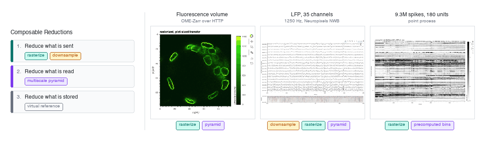

# Interactive Visualization of Large Array Data

A hands-on tutorial on plotting neuroscience arrays that are far larger than the screen, using
[HoloViews](https://holoviews.org), [Panel](https://panel.holoviz.org),
[Datashader](https://datashader.org), [Xarray](https://docs.xarray.dev), and
[Zarr](https://zarr.readthedocs.io).

Three kinds of neuro data, composable reductions at every boundary from disk to screen.

<p></p>

## What it covers

| Data | Source | Technique |
| --- | --- | --- |
| Two-channel fluorescence volume | OME-Zarr, read over HTTP, never downloaded | Rasterization, and reading the pyramid level that matches the zoom |
| 35-channel local field potential, 9675 s at 1250 Hz | NWB from the Allen Institute | LTTB downsampling in memory, then a written multiscale pyramid |
| 9,275,313 spike times from 180 units | The same recording session | Rasterization of a point process, with precomputed rates for the coarse end |

It also covers reading an HDF5 archive through a Zarr interface without copying it, using
[VirtualiZarr](https://virtualizarr.readthedocs.io), and where that does and does not help.

## Quickstart

Requires [pixi](https://pixi.sh).

```bash
git clone https://github.com/droumis/viz-large-neuro.git
cd viz-large-neuro
pixi install
pixi run lab
```

The first run downloads ~900 MB of electrophysiology data and builds a ~2 GB pyramid.
The imaging data streams from a remote store and requires no download.

To read the notebook without running it, open `large_array_viz.py`, which is the source of truth
and is plain text. Each section embeds a small preview image of what its code produces, so the
narrative is readable without executing anything.

## Disk and network footprint

**A first run downloads or generates about 2.9 GB**, plus roughly 3.5 GB for the environment.
Everything is cached and every step is skipped if its output already exists.

| What | Size | When |
| --- | --- | --- |
| pixi environment (`.pixi/`) | ~3.5 GB | `pixi install` |
| LFP recording, NWB | 857 MB downloaded | first run of the downsampling section |
| Multiscale pyramid, Zarr | 2.1 GB written | first run of the pyramid section, about a minute |
| Spike times, npz cache | 88 MB written, ~74 MB transferred | first run of the point process section |
| Virtual Zarr manifest, JSON | 1.5 MB written | first run of the reference section |
| Imaging volume | nothing, read over HTTP | every run |

Everything generated goes into `data/`, which is gitignored. Deleting `data/` returns the repo to
its cloned state, and the next run regenerates it.

## Running it as an app

The last section composes the plots into a Panel app.

```bash
pixi run serve
```

## Data sources and attribution

**Fluorescence microscopy.** Image Data Resource dataset
[idr0062](https://idr.openmicroscopy.org/search/?query=Name:idr0062), read from the EMBL-EBI
Embassy object store as OME-Zarr 0.4. See the
[IDR study page](https://idr.openmicroscopy.org/) for terms and the associated publication.

**Local field potential and spike times.** Allen Brain Observatory Visual Coding Neuropixels,
session 754312389, probe 756781563. See the
[Allen Institute terms of use](https://alleninstitute.org/legal/terms-use/) and the
[dataset documentation](https://allensdk.readthedocs.io/en/latest/visual_coding_neuropixels.html).
Both files are read directly from the Allen Institute's public S3 bucket. The notebook builds
every URL from a session id and a probe id, and reads the release's own `sessions.csv` and
`probes.csv` indexes, so any other session or probe can be substituted by changing two
integers.
